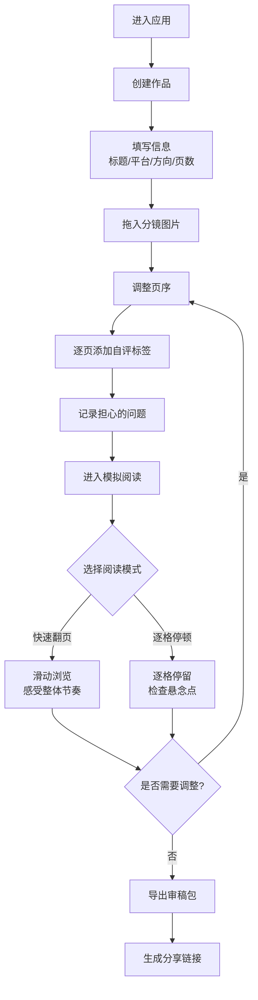

## 1. 产品概述

分镜自查工具是一款面向独立漫画作者的极简在线辅助工具，帮助作者在投稿前对分镜进行自我审阅和节奏把控。工具聚焦于投稿前的"最后一公里"，而非复杂协作，让作者快速验证一话内容的阅读流畅度和悬念布局。

- 核心用户：独立漫画作者、个人创作者、漫画投稿新人
- 核心价值：通过手机竖屏模拟阅读+自评标签+审稿包导出，降低分镜自查门槛，提升投稿质量

## 2. 核心特性

### 2.1 功能模块
1. **上传整理页**：作品信息录入、分镜图片拖放上传、页序管理、自评标签与问题记录
2. **模拟阅读页**：手机竖屏阅读模拟、快速翻页/逐格停顿双模式、悬念点位置感知

### 2.2 页面详情

| 页面名称 | 模块名称 | 功能描述 |
|-----------|-------------|---------------------|
| 上传整理页 | 作品信息卡片 | 输入标题、选择目标平台、阅读方向（从上到下/从右到左）、预计页数 |
| 上传整理页 | 图片拖放画布 | 拖拽上传分镜草图、支持批量导入、缩略图展示 |
| 上传整理页 | 页序管理面板 | 拖拽排序、删除单页、页码显示、快速跳转 |
| 上传整理页 | 自评标签栏 | 每页可选：铺垫/爆点/转场/打斗/日常/悬疑/搞笑/情感 |
| 上传整理页 | 问题记录区 | 每页可记录担心的问题（节奏/画面/剧情等） |
| 上传整理页 | 开始阅读入口 | 一键进入模拟阅读模式 |
| 上传整理页 | 导出审稿包 | 生成包含图片、页序、自评说明的可分享链接 |
| 模拟阅读页 | 手机竖屏容器 | 模拟真实手机阅读比例和边框效果 |
| 模拟阅读页 | 阅读模式切换 | 快速翻页（滑动）/逐格停顿（点击+定时） |
| 模拟阅读页 | 悬念指示器 | 页面角落显示当前页标签类型，爆点页有特殊强调 |
| 模拟阅读页 | 问题悬浮层 | 翻到对应页时可查看作者自评的问题备注 |
| 模拟阅读页 | 返回整理 | 一键返回上传整理页继续编辑 |

## 3. 核心流程

### 3.1 主要用户流程
作者创建作品 → 填写基本信息 → 批量拖入分镜图 → 调整页序 → 逐页添加自评标签和问题 → 进入模拟阅读 → 切换两种模式感受节奏 → 根据阅读体验调整分镜 → 导出审稿包分享给编辑/朋友

### 3.2 流程图

## 4. 用户界面设计

### 4.1 设计风格

- **主色调**：米白/浅米色背景（#FAF8F5），搭配深墨灰文字（#2C2A27），营造纸张/原稿的质感
- **点缀色**：暖橙色（#E8744A）用于强调按钮和爆点标签，墨绿（#4A6B5C）用于次要操作
- **按钮风格**：微圆角（6px）、扁平化、细边框，hover时轻微上浮+阴影
- **字体**：标题使用具有手写感的衬线字体（Noto Serif SC），正文使用简洁无衬线（Noto Sans SC）
- **布局风格**：卡片式分区、大量留白、纸质感背景纹理、手绘风辅助线
- **图标风格**：简约线性图标，略带手绘感，统一1.5px描边

### 4.2 页面设计概述

| 页面名称 | 模块名称 | UI元素 |
|-----------|-------------|-------------|
| 上传整理页 | 作品信息卡 | 顶部横向排列输入框，浅灰底卡片，左侧虚线边框装饰 |
| 上传整理页 | 拖放画布 | 大面积虚线边框区域，中央手绘风格的上传提示图标，支持点击和拖拽 |
| 上传整理页 | 页序列表 | 横向缩略图滚动条，每页卡片下方显示页码和标签徽章 |
| 上传整理页 | 自评面板 | 右侧抽屉式展开，标签用彩色圆角按钮，问题输入框用浅米色底 |
| 上传整理页 | 底部操作栏 | 固定底部，"开始阅读"主按钮居右，"导出审稿包"次按钮居左 |
| 模拟阅读页 | 手机容器 | 居中黑色手机边框，圆角屏幕，屏幕内显示漫画页 |
| 模拟阅读页 | 模式切换 | 手机上方Tab切换，选中态为暖橙色下划线 |
| 模拟阅读页 | 标签徽章 | 屏幕左下角浮动小标签，爆点时放大并闪烁提示 |
| 模拟阅读页 | 进度条 | 手机下方细线进度条，实时标记阅读位置 |
| 模拟阅读页 | 问题提示 | 右下角小问号图标，hover展开便签式问题说明 |

### 4.3 响应式

- 桌面端优先设计，充分利用宽屏展示
- 上传整理页采用左右布局：左侧画布+列表，右侧自评面板
- 平板端：自评面板改为抽屉式，从右侧滑出
- 移动端：单列布局，画布优先，操作按钮固定底部
- 模拟阅读页的手机容器在各尺寸下保持等比缩放
