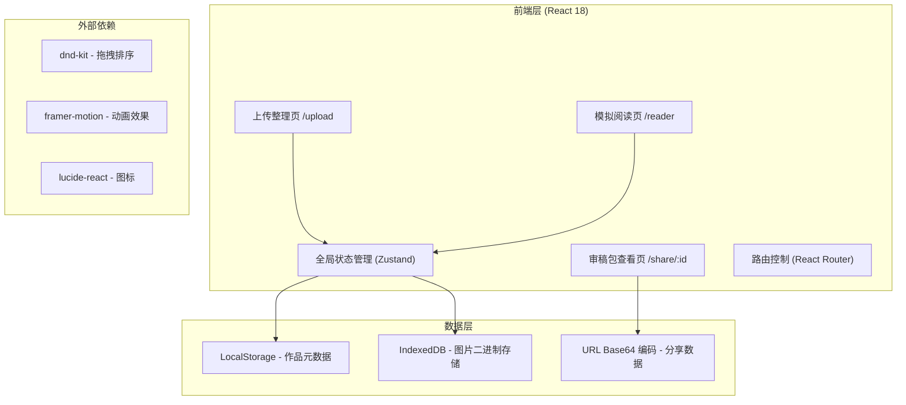

## 1. 架构设计

本项目为纯前端单页应用（SPA），无需后端服务，数据存储于浏览器本地（LocalStorage + IndexedDB），分享链接功能通过URL参数编码实现零后端依赖。



## 2. 技术说明

- **前端框架**：React@18 + TypeScript
- **构建工具**：Vite@5
- **样式方案**：TailwindCSS@3 + 自定义CSS变量
- **状态管理**：Zustand@4（轻量级状态管理，避免Redux冗余）
- **路由**：React Router@6（HashRouter，兼容静态部署）
- **拖拽**：@dnd-kit/core + @dnd-kit/sortable（页序排序+文件拖放）
- **动画**：framer-motion@11（翻页动效+微交互）
- **图标**：lucide-react@0（线性简约图标）
- **后端**：无，纯前端静态部署
- **存储**：LocalStorage（作品JSON元数据）+ IndexedDB（图片文件）
- **分享机制**：将审稿包数据编码为Base64嵌入URL哈希，零后端依赖

## 3. 路由定义

| 路由 | 页面名称 | 用途 |
|-------|---------|------|
| / | 首页重定向 | 重定向至作品列表或新建作品页 |
| /upload | 上传整理页 | 创建/编辑作品、上传图片、添加自评标签 |
| /reader | 模拟阅读页 | 手机竖屏模拟阅读、双模式切换 |
| /share/:data | 审稿包查看页 | 通过分享链接打开，只读模式查看审稿内容 |

## 4. 数据模型

### 4.1 类型定义

```typescript
// 自评标签枚举
type PageTag = 'setup' | 'climax' | 'transition' | 'fight' | 'daily' | 'suspense' | 'comedy' | 'emotion';

// 阅读方向
type ReadDirection = 'vertical' | 'rtl';

// 目标平台
type Platform = 'wechat' | 'kuaikan' | 'bilibili' | 'dongman' | 'other';

// 单页分镜数据
interface ComicPage {
  id: string;
  index: number;
  imageDataUrl: string;
  fileName: string;
  tag: PageTag | null;
  concerns: string; // 作者担心的问题
  createdTime: number;
}

// 作品数据
interface Work {
  id: string;
  title: string;
  platform: Platform;
  readDirection: ReadDirection;
  estimatedPages: number;
  pages: ComicPage[];
  createdTime: number;
  updatedTime: number;
}

// 审稿包分享数据（精简版，用于URL编码）
interface SharePackage {
  t: string; // title
  p: Platform; // platform
  d: ReadDirection; // direction
  pg: Array<{
    i: string; // imageDataUrl (可能是缩略图)
    t: PageTag | null; // tag
    c: string; // concerns
  }>;
}
```

### 4.2 存储策略

- **作品元数据**：存储于 LocalStorage，Key 为 `comic-checklist:work:${workId}`，JSON 序列化
- **图片数据**：初始上传时转为 DataURL，整合作品元数据中；考虑到 LocalStorage 5MB 限制，页数较多时自动启用 IndexedDB 存储图片，元数据中仅保留 IDB key
- **分享链接**：将 SharePackage 编码为 URL 安全的 Base64 字符串，嵌入 Hash 路由；若数据超过 2000 字符上限，提示用户下载 JSON 文件并手动分享

## 5. 状态管理设计

### Zustand Store 结构

```typescript
interface ComicStore {
  currentWork: Work | null;
  selectedPageId: string | null;
  readMode: 'flip' | 'pause'; // 快速翻页/逐格停顿
  pauseDuration: number; // 逐格停顿秒数
  actions: {
    createWork: (data: Partial<Work>) => void;
    updateWork: (data: Partial<Work>) => void;
    addPages: (files: File[]) => Promise<void>;
    removePage: (pageId: string) => void;
    reorderPages: (fromIndex: number, toIndex: number) => void;
    selectPage: (pageId: string | null) => void;
    setPageTag: (pageId: string, tag: PageTag | null) => void;
    setPageConcerns: (pageId: string, concerns: string) => void;
    setReadMode: (mode: 'flip' | 'pause') => void;
    generateShareLink: () => string;
    loadFromShare: (encoded: string) => SharePackage;
  };
}
```

## 6. 核心组件树

```
App (Router Provider + Store Provider)
├── UploadPage
│   ├── WorkInfoForm (作品信息表单)
│   ├── DropzoneCanvas (拖放画布)
│   ├── PagesStrip (页序横向滚动条)
│   │   └── PageThumbCard [可排序]
│   ├── SidePanel (右侧自评面板)
│   │   ├── TagSelector (标签选择器)
│   │   ├── ConcernsInput (问题输入框)
│   │   └── PagePreview (当前页预览)
│   └── ActionBar (底部操作栏)
├── ReaderPage
│   ├── PhoneFrame (手机外框容器)
│   │   ├── ModeTabs (阅读模式切换)
│   │   ├── ComicViewport (漫画视窗)
│   │   │   ├── PageRenderer [可动画]
│   │   │   └── TagBadge (标签悬浮徽章)
│   │   ├── ProgressBar (阅读进度条)
│   │   └── QuestionTip (问题提示浮层)
│   └── ReaderControls (顶部/底部控件)
└── SharePage (只读审稿包视图)
    ├── PackageHeader (作品信息)
    ├── ShareViewer (图片+标签+问题展示)
    └── DownloadButton (下载审稿包)
```

## 7. 性能优化策略

1. **图片懒加载**：ReaderPage 中仅渲染当前页+前后各1页
2. **缩略图优化**：上传时自动生成缩略图（最长边 300px）用于 PagesStrip
3. **内存管理**：切换页面时清理未使用的 Image 对象引用
4. **分批处理**：批量上传超过 10 张图片时分批解码，避免 UI 阻塞
5. **虚拟列表**：页序列表支持虚拟滚动（超过 30 页时启用）
